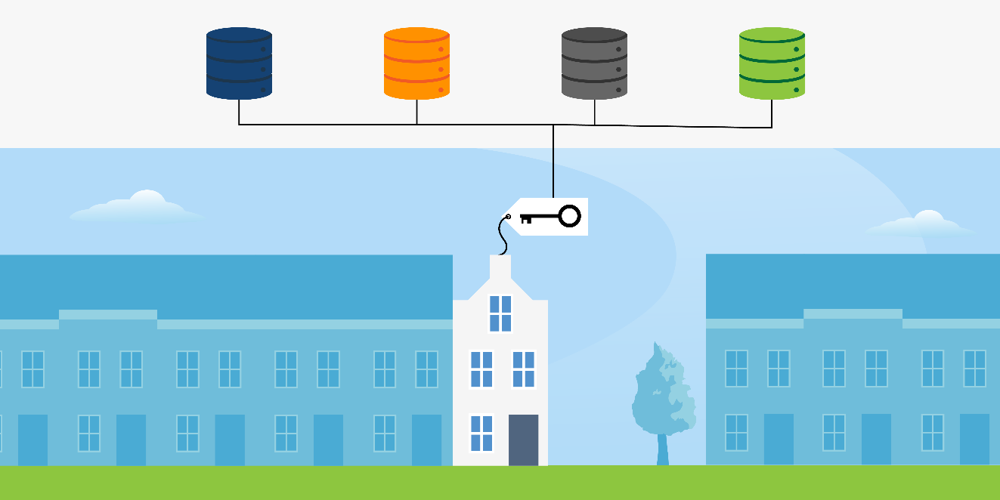
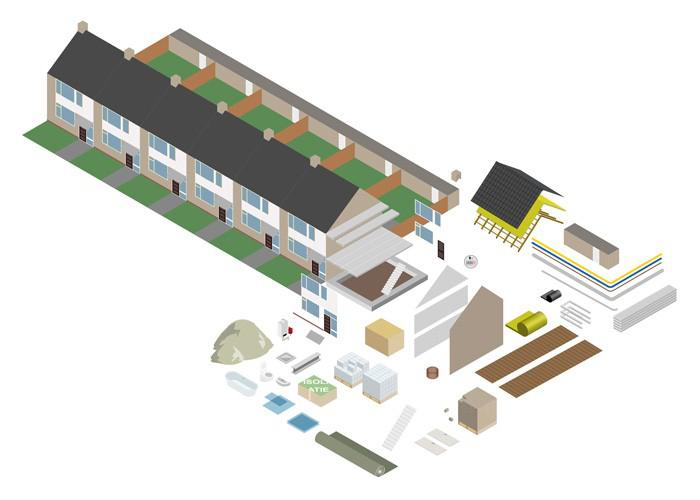
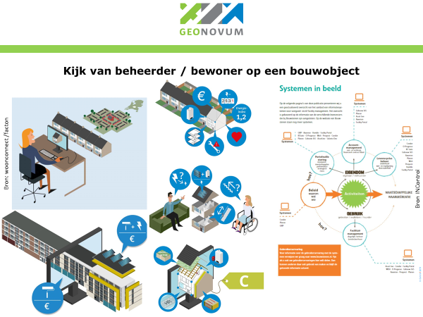
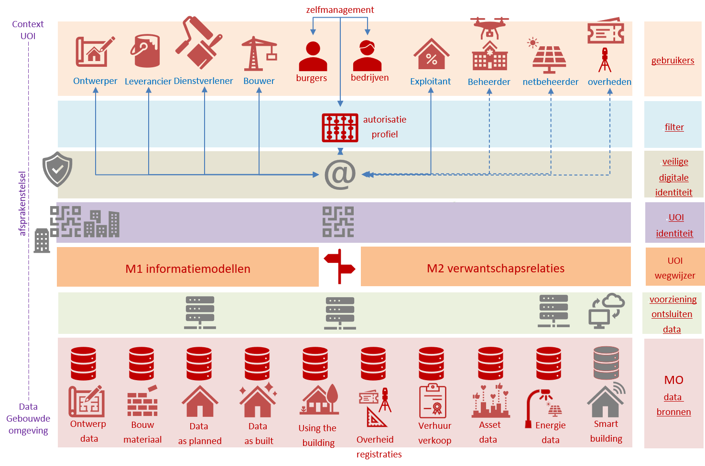

Rapport

Programma van Eisen (functioneel)

UOI Unieke Object Identificatie

Geonovum

versie v0.4 voor consultatie

# Inleiding

In dit hoofdstuk wordt de aanleiding en context voor het vervolgonderzoek UOI op hoofdlijnen geschetst. Tevens worden de beoogde stappen in het vervolgonderzoek benoemd. Tenslotte wordt de inhoud van dit _Programma van Eisen (PvE) (functioneel)_ als leeswijzer beschreven.

## Aanleiding en context

**Regie op gegevens**

Er worden steeds meer gegevens over personen, objecten en transacties verzameld, opgeslagen en gebruikt. Gegevens die door bedrijven, overheden en instellingen worden gebruikt om hun dienstverlening scherper te vermarkten en door te ontwikkelen. Door het gebruik van cookies en slimme algoritmes komt de persoonlijke regie op deze gegevens in het gedrang. Overheden hebben hierop gereageerd door wet- en regelgeving, zoals de AVG, in te stellen. De AVG formuleert de formele spelregels voor het aanleggen en gebruiken van gegevens die op de persoon zijn te herleiden. Daarnaast is het [programma "Regie op Gegevens"](https://www.digitaleoverheid.nl/overzicht-van-alle-onderwerpen/regie-op-gegevens/) gestart, dat beoogt personen meer regie op het gebruik van persoons gerelateerde gegevens te bieden.

> Het gebruik van bijvoorbeeld het BSN-nummer (dat personen in Nederland uniek identificeert) is gelimiteerd. Tegelijkertijd biedt de BSN (als unieke identificator naar personen (subjecten)) ook heel veel voordelen om persoon-gerelateerde gegevens te koppelen waar dat is toegestaan. Veel gegevens worden als alternatief voor de BSN op locatie (adres) of IP-nummer gekoppeld.

Regie op gegevens beperkt zich niet strikt tot de gegevens over de persoon zelf. Het gaat ook over regie over gegevens die samenhangen met bezit en gebruik.

**Regie op bouwgegevens**

In het fysieke domein in Nederland is er nog geen unieke identificator voor alle objecten (UOI). In de verschillende domeinen worden verschillende sleutels gebruikt om objecten te identificeren. Tegelijkertijd bestaat zowel nationaal als internationaal de behoefte om objecten uniek te kunnen identificeren. Dit om zo allerhande analyses te kunnen doen waarin het object als fenomeen een verbindende rol speelt. Denk aan vraagstukken omtrent woningvoorraad, energietransitie, klimaatadaptatie, kwaliteitsborging bouwen enz. Zoals gezegd worden gegevens over objecten van oudsher per domein vastgelegd en gebruikt. Qua levensfase van objecten zijn deze domeinen overlappend. Denk aan de domeinen ruimtelijk planning van de leefomgeving, eisenspecificatie, ontwerp, bouw (incl. herbouw en verbouw), gebruik en beheer almede aanpalende sectoren als productie en levering van bouwmaterialen, vergunningverlening, toezicht en handhaving enz.

Het gebruik van een UOI-code (dat objecten in Nederland uniek identificeert) is nog geen gemeengoed. Binnen de bouwwereld is door het Industrie Foundation Classes (IFC) nu vastgelegd in de ([ISO 16739-1:2018](https://www.bimloket.nl/p/103/IFC)) al decennia geleden een soort UOI op projectniveau ingevoerd. Deze identifier wordt wereldwijd al binnen de objectidentificatie van bouwobjecten in de gehele levensfase van een bouwobject benut. We zien dit ook in de BIM-standaarden terugkomen. Deze object-identificatoren zijn binnen projecten uniek maar daarmee nog niet uniek op domein, nationaal of wereldwijd niveau.

## Vervolgonderzoek

**Opvolgen eerste Fibree onderzoek UOI**

De [Fibree-organisatie](https://fibree.org/) heeft samen met het Kadaster in opdracht van het ministerie van BZK begin 2020 een onderzoek naar een unieke object identificator uitgevoerd. De resultaten van dit onderzoek staan beschreven in het "[_Rapport Unique Object Identifier (UOI) onderzoeksfase project Regie op Bouwgegevens_](https://www.geobasisregistraties.nl/documenten/rapport/2020/12/01/rapport-regie-op-bouwgegevens-uoi-2020-onderzoeksfase)"" d.d. 25 mei 2020. De uitkomsten van dit onderzoek gaven aanleiding tot het instellen van een vervolgonderzoek. Het ministerie van BZK heeft Geonovum gevraagd dit tweede onderzoek naar een Unieke Object Identificator (UOI) voor objecten in de fysieke omgeving uit te voeren. Geonovum heeft een UOI-team samengesteld waarin ook het Kadaster participeert.

**Validatie en inpassen in het stelsel van geo-registraties**

Het eerste UOI-onderzoek gaf nog beperkt zicht op de effecten van een UOI in het stelsel van geo-registraties. In dit stelsel loopt het [DIS-GEO programma](https://www.geobasisregistraties.nl/basisregistraties/doorontwikkeling-in-samenhang) waarin gewerkt wordt aan een harmonisatie op de eenheid van registratie naar een [samenhangende Objecten registratie (SOR)](https://www.geobasisregistraties.nl/basisregistraties/doorontwikkeling-in-samenhang/objectenregistratie). Dit vervolgonderzoek bestaat uit een aantal stappen waarbij de uitkomsten van het eerste UOI-onderzoek door [Fibree](https://fibree.org/) worden gevalideerd en tevens worden aangevuld met functionele eisen en mogelijk technische oplossingen. Uiteindelijk wordt een UOI ontwerp (versie V 0.9) opgeleverd. Dat resultaat wordt getoetst door Kadaster en Fibree aan een viertal gebruikssituaties (use-cases) en tevens door Geonovum ter consultatie voorgelegd aan belanghebbenden in Nederland. Aansluitend wordt een SWOT-analyse opgesteld.

Daarna zal een stappenplan, communicatieplan gericht op implementatie alsmede een Plan van Aanpak en kostenraming van de beoogde NL-brede implementatie worden opgesteld alvorens er formele besluitvorming over de mogelijke implementatie van een UOI-code wordt voorbereid.

## Afsprakenstelsel

In het eerder opgestelde Validatierapport V06 vanuit Geonovum is een beknopte beschrijving van het werkveld opgenomen waarin de UOI-code haar identificerende en verbindende rol speelt. Situaties om de UOI-code succesvol te laten zijn, zijn qua werking geschetst.

Een UOI-code kan natuurlijk alleen succesvol worden benut, wanneer tevens er een UOI-afsprakenstelsel bestaat dat regelt hoe UOI-codes worden uitgegeven, gebruikt en beheerd. Het UOI-code-stelsel treedt daarmee op als een _vertrouwens-infrastructuur_ binnen de gebouwde omgeving. Oogmerk daarvan is dat mensen/organisaties ervan op aan kunnen dat met de UOI-code en UOI-stelselafspraken informatie over een object (of delen daarvan) altijd (mits vastgelegd) terug-vindbaar zijn. Er is hier samenhang met de in het denken over het [DGSO Digitaal Stelsel Gebouwde Omgeving](https://digigo.nu/dsgo/default.aspx) genoemde afsprakenstelsel.

Het UOI-afsprakenstelsel dient daartoe elementen voor een succesvol duurzaam proces van uitgifte, gebruik van UOI-'s dient te omvatten. Daast is georganiseerd beheer op het afsprakenstelsel van belang.

> Een afsprakenstelsel is het geheel van juridische, organisatorische, financiële, semantische en technische afspraken, bedoeld om vertrouwen tussen betrokken partijen te borgen in een door het stelsel geboden vorm of aspect van [Regie op Gegevens (RoG).](https://www.digitaleoverheid.nl/dossiers/rog-regie-op-gegevens/) Deelnemers committeren zich aan de afspraken en kunnen op basis van de reeds overeengekomen afspraken, diensten aanbieden dan wel benutten. <bron RoG-kader>

Het UOI-afsprakenstelsel functioneert daarmee als een mogelijkheid tot bieden van domein-overschrijdende interoperabiliteit en delen van gegevens in de gebouwde omgeving. Het gaat daarbij zowel om gegevens in het zogeheten geo-domein als gegevens in het bouw-domein. Gegevens die over een fysiek[^fysiek] of/en een virtueel[^virtueel] object kunnen betreffen en tevens in de levenscyclus van een bouw-object kunnen voorkomen en veranderen.

[^fysiek]: NEN 2660 NEN 3610 spreken over reëel dan wel materieel object (synoniemen)
[^virtueel]: NEN 2660 NEN 3610 spreken over niet-reëel dan wel immaterieel object (synoniemen)

## Leeswijzer

Dit document bevat de resultaten van de door Geonovum in opdracht van het ministerie van BZK uitgevoerde onderzoekstap naar de Functionele eisen voor het ontwerp Unieke Object Identificator (hierna UOI)

In hoofdstuk 2 schetsen we eerst een beeld van de UOI-code en het beoogde UOI-code-stelsel en geven enig zicht op bijbehorende, vanuit de functionaliteit afgeleide, gewenste afspraken. We gaan in op het doel van een UOI-code en de onderdelen van een UOI-code stelsel. Dat zijn de volgende onderdelen:

- Uniek identificeren van het object
- Vinden van de wegen naar de databronnen over het object
- Ontsluiten van de data uit de databronnen
- Semantisch kunnen duiden van de gevonden data

We doen dit om de lezer inzicht vooraf te geven zodat de functionele eisen in hoofdstuk 3 een plek kunnen krijgen.

In hoofdstuk 3 worden de _Functionele eisen_ benoemd die gehanteerd zijn om het UOI-ontwerp te kunnen doen. Deze functionele eisen zijn onderverdeeld naar de volgende ontwerpaspecten van het UOI-afsprakenstelsel:

- Functionele eisen waar een UOI-code aan moet voldoen
- Eisen aan de UOI-uitgifte
- Eisen aan het UOI-gebruik
- Eisen aan het UOI-beheer van alle elementen van het UOI-stelsel
- Eisen aan oplossingsrichtingen bij het ontwerp
- Eisen aan implementatie / kunnen invoeren
- Eisen aan het afsprakenstelsel
- Eisen aan beheer

In de bijlagen vindt u de documenten en bronnen vermeld welke in deze documentenstudie zijn geraadpleegd.

Hoewel dit een zelfstandig leesbaar rapport is, raden we de lezer aan kennis te nemen van het [eerste UOI-onderzoekrapport door Fibree](https://fibree.org/uoi-NL/) en het Validatierapport UOI V06 van Geonovum

Na deze fase van het formuleren van een Programma van Eisen, zal een Ontwerprapport worden opgesteld.

# Impressie UOI-code-stelsel

In dit hoofdstuk wordt een impressie gegeven hoe de UOI-code past in het UOI-code-stelsel en de daarbij denkbare behorende voorzieningen en afspraken. Al snel bleek dat het louter toekennen van een UOI-code zonder het gebruik daarvan voor zoeken en vinden van gegevens over objecten in de gebouwde omgeving daarin te betrekken slechts beperkte waarde zou hebben. Het onderzoeksteam heeft de onderzoeksopdracht, na overleg met de opdrachtgever, breder aangevlogen dan oorspronkelijk geformuleerd.

## Doel van een UOI-code

De UOI-code is een beoogd universeel toepasbare manier om objecten in de gebouwde omgeving te kunnen identificeren. Met deze unieke identificatie (mechanisme) die minimaal gedurende de levensloop van een object blijft bestaan, kunnen dan meerdere gegevensverzamelingen onderling verbonden worden om daarmee **integrale vraagstukken makkelijker te kunnen beantwoorden**. Integrale vraagstukken kenmerken zich doordat de gegevens, die nodig zijn voor het beantwoorden, zich vaak in meerdere domeinen bevinden. De UOI-code beoogt data vindbaar en toegankelijk te maken, onafhankelijk van waar deze data zich bevindt. _Data-integratie_ rondom objecten wordt daardoor mogelijk mits er tevens afspraken gemaakt worden over die toegankelijkheid.

## Gebouwde omgeving

De gebouwde omgeving is in dit kader gedefinieerd als de verzameling domeinen waar gegevens in de vorm van informatieobjecten worden vastgelegd over:

- Alle _fysieke[^fysiek2] objecten_ die als onroerende zaken worden aangeduid (zoals gebouwd, geplaatst, geïnstalleerd, gelegd, aangelegd dan wel duurzaam aanwezig in de grond of het water maar ook _niet-gebouwde_ fysieke objecten die wel van belang zijn voor de gebouwde omgeving zoals aanwezig in de topografische basisregistraties);
- Alle _virtuele[^virtueel2] objecten_ die vanuit _wet- en regelgeving_ en/of _maatschappelijk verkeer_ gerelateerd zijn aan de fysieke objecten (zoals over gebruik, eigendom, heffing, subsidie, vergunning, adres, werkingsgebieden, beheergebieden, verzorgingsgebieden).

_Niet_ meegenomen in de reikwijdte t.b.v. de UOI-code worden onderwerpen als:

- Gebeurtenis-gebaseerde zaken (transacties) (zoals levering, overdracht, vergunning, enz.) betreffende de hierboven genoemde objecten;
- De productie van bouwmaterialen en bouwproducten (hiervoor wordt de GS1-code[^gs1] veel gebruikt).

[^fysiek2]: Fysiek (materieel of reëel)
[^virtueel2]: Virtueel (immaterieel of niet-reëel)
[^gs1]: [GS1-code](https://www.gs1.nl/) is een productcode die veel gebruikt wordt in de productie-industrie

## Soorten objecten met een UOI-code

In de gebouwde omgeving komen zowel fysieke als virtuele[^fysiekvirtueel] objecten voor. Virtuele objecten worden veelal gebruikt in bouw- en geo-registraties en in bouw- en overheidsprocessen om het werk in een domein te bundelen en/of te vereenvoudigen. Denk aan een bouwblok (de bouwstroom), een WOZ-object (voor WOZ-heffing) of appartement (eigendomsrecht binnen een complex). Het detailniveau van de informatiebehoefte varieert sterk. In het ene domein volstaat het dat men het adres kent, in het andere domein wil men de functionele of zelfs de technische onderdelen en hun opbouw kennen.

[Granulariteit](https://nl.wikipedia.org/wiki/Granulariteit_(gegevens)) (de mate waarin detailgegevens van een entiteit (lees object) bekend zijn) kan daarin aanzienlijk verschillen per domein en/of registratie. Er worden tevens verschillen geconstateerd in de (de)compositie[^decompositie] waarin een object wordt gedetermineerd in samenstellende delen. Daarmee kan het begrip object in de gebouwde omgeving een object als bouwwerk, een verzameling van bouwwerken, maar ook detailonderdelen van dat bouwwerk betreffen. In de onderstaande figuur wordt dat mooi gevisualiseerd.

Figuur 1. Samenstellende delen van een bouwwerk (bron [ESRI](https://www.esri.nl/nl-nl/home))

Een soortgelijk figuur is ook denkbaar voor de beheer-registraties van een bouwwerk en de overige locatie-gebonden administraties van organisaties die vastgoed of objecten in de gebouwde omgeving beheren en exploiteren.

> De figuur toont een visualisatie van het Bouwwerkinformatiemodel (BIM)[^bim] in het bouwdomein, waarin hier de buitenkant en de binnenkant van het gebouw vanuit de kleinst mogelijke details (bouwwerkelementen) is opgebouwd, vastgelegd en beheerd. Dit levert uiteindelijk een compleet 3D-model van het gebouw op, waarbij de buitenkant een afgeleide is van de verschillende elementen c.q. niveaus uit BIM (vloeren, wanden, binnenruimten, bouwlagen etc.). (bron [DIS-GEO rapport Eindrapport werkgroep bouwwerken](https://www.geobasisregistraties.nl/documenten/rapport/2020/02/26/verkenning-samenhangende-objectenregistratie-eindrapport-werkgroep-bouwwerken))

Figuur 2. Samenstellende delen in een het domein beheer-registraties (bron [Woonconnect](https://woonconnect.nl/))

Een soortgelijk figuur is ook denkbaar voor de geo-registraties van een bouwwerk en de overige locatie-gebonden administraties van overheden die raken aan fysieke objecten zoals plan-, bouw- en energieregels.

Figuur 3. Samenstellende delen in een het domein geo-registraties (Bronnen [Toba Architecten](https://toba.nl/) en [DISGEO](https://www.geobasisregistraties.nl/basisregistraties/doorontwikkeling-in-samenhang/objectenregistratie))

[^fysiekvirtueel]: Virtuele objecten zijn door de mens gehanteerde objecten om een specifieke eigenschap van een fysiek object of gebied vast te leggen. Denk aan een WOZ-object of een werkingsgebied van een juridische regel. De objectbeschrijving van zowel een virtueel object als een fysiek object zijn representaties van de werkelijkheid zoals deze door de mens wordt beschouwd.
[^decompositie]: Deel/geheel opbouw (aggregatie cq. detaillering)
[^bim]: BIM is een digitaal model van alle fysieke en functionele kenmerken van een bouwwerk in 3D voor de ondersteuning van de volledige levenscyclus van een gebouw. Dus ontwerp – bouw gebruik – sloop. Gedurende de levenscyclus kan dit model worden aangepast aan de actuele gebouwsituatie. ([bron DIS-GEO rapport Eindrapport werkgroep bouwwerken](https://www.geobasisregistraties.nl/documenten/rapport/2020/02/26/verkenning-samenhangende-objectenregistratie-eindrapport-werkgroep-bouwwerken))

## De UOI-code aan een informatie-object hangen

Vinden en kunnen gebruiken van gegevens in meerdere domeinen vraagt om meer dan identificatie van een object. Het vraagt ook om het semantisch kunnen interpreteren van de gevonden gegevens en natuurlijk ook om gegevens over het gezochte object te kunnen relateren. Met het object wordt hier het fysieke/virtuele object bedoeld. Daarbij is het verleidelijk te denken dat we dan aan dat fysieke/virtuele object de UOI-code toekennen. Binnen één domein is dat mogelijk omdat daar één objectdefinitie gehanteerd wordt. Over de domeinen heen verschillende die objectdefinities. Willen we de UOI-code laten werken zonder alle domeinen qua objectdefinities te moeten harmoniseren lijkt het onvermijdelijk dat we de UOI-code aan het informatieobject toekennen. Een informatieobject beschrijft immers de gegevens over een fysiek/virtueel object. We kunnen dan op basis van 'we bedoelen hier hetzelfde object' deze relaties tussen informatieobjecten uit verschillende domeinen benoemen. We kennen dit uit de linked-data wereld.

## Objecten veranderen gedurende hun levensloop

Objecten in de fysieke leefomgeving veranderen gedurende hun levensloop zowel fysiek als qua informatie-object in de bouw- en geo-registraties. Tegelijkertijd willen we de gegevens van het oude en het veranderde object blijven kennen en kunnen relateren. We geven een paar voorbeelden.

Een ontwerp voor een bouwwerk verandert meestal meerder keren gedurende het ontwerpstadium als gevolg van veranderende eisen, beperkte budgetten of regelgeving.

De _"als ontworpen"-dataset_ bevat de eindversie van het ontwerp. Uiteindelijk wordt een vergunning veelal verstrekt op een ontwerp dat tevens de basis is voor het realiseren van het bouwwerk, maar ook dat kan in enkele iteraties verlopen.

De _"als-vergund"-dataset_ bevat de eindversie. Bij grote bouwwerken kan ontwerp, werkvoorbereiding en realisatie ook overlappen waardoor de dataset voortdurend in transitie is.

Maar ook dan kan door de feitelijke beschikbaarheid van bouwmaterialen, de keuze van de bouwer voor bouwmaterialen en tussentijds meer- en minderwerk er het nodige veranderen. In de _"als gebouwd"-dataset_ worden de gegevens van het gerealiseerde vastgelegd en overgedragen aan de opdrachtgever, beheerder, bevoegd gezag en gebruiker.

In de beheerfase van de levensloop van een object kunnen allerhande aanpassingen gedaan worden. Een aanbouw, een verbouw, splitsen van een gebouw qua gebruik en ruimtes dan wel samenvoegen daarvan. Ook is denkbaar dat 2 woningen tot 1 verbouwd worden of dat een grote woning in meerde woningen wordt gesplitst, een bedrijfsverzamelgebouw ontstaat enz. Allemaal gebeurtenissen die leiden tot fysieke veranderingen maar ook tot administratieve veranderingen. In dat soort situaties wil je de reeds verstrekte UOI-code voor een informatieobject niet kwijtraken ook al 'verandert' het object/informatieobject dan wel dat er object(en)/informatie-object(en) bijkomen.

## Gebouwde omgeving kent meerdere domeinen

De UOI-code is dus de beoogde identificator voor informatie-objecten die in de verschillende domeinen binnen de gebouwde omgeving onderscheiden worden. Gebouwde omgeving zien we in eerste aanleg als dat deel van onze leefomgeving waarin gebouwde objecten door de mens zijn aangebracht. Denk aan bouwwerken zoals vastgoed (woonhuizen, bedrijfspanden, kunstwerken in de infrastructuur en ander bouwsels). Dergelijke bouwwerken worden in de regel ruimtelijk minimaal beschreven via een geometrie, hebben na verloop van tijd een locatie en soms ook een functionele respectievelijk een fysieke opbouw. Van oudsher heeft de overheid dergelijke bouwwerken geregistreerd. Daaruit zijn zowel bouw- als geo-registraties ontstaan in meerdere domeinen. Denk aan belastingheffing, eigendomsregistratie enz. In Nederland is inmiddels een [stelsel van geo-basisregistraties](https://www.digitaleoverheid.nl/nieuws/stelsel-van-basisregistraties-krijgt-wettelijke-basis/?pk_campaign=nieuwsbrief-19-2020) ontstaan. In de bouw is in Nederland een dergelijk stelsel [DGSO Digitaal Stelsel gebouwde Omgeving](https://digigo.nu/dsgo/default.aspx) in wording.

Hieronder is een impressie gegeven van bouw-, beheer en geo-registraties die voorkomen en waar de UOI-code een rol kan spelen in het domein-overstijgend ontsluiten van gegevens over bouwwerken.

|Bouw-registraties | Beheer-registraties | Geo-registraties |
|---|---|---|
| Ontwerp-registraties Vergunningenregister Bouwmaterialenproductieregister Bouwmaterialen leverregister Bouwmateriaal-verwerkregister Dossier bevoegd gezag (as built) Consumentendossier enz | Te beheren objecten (areaal) Exploitatieregistraties Verhuurregistraties Onderhoudsregistraties Installatieregisters Aansluitingenregisters Energie-prestatie-labels Veiligheidsregistratie Makelaarsregistraties | Kadastrale registratie (eigendomobjecten) BRK Topografie (leefomgeving + objecten) BGT BRT Adressen & Gebouwen BAG Waarde onroerende zaken WOZ Kabels & leidingen KLIC Planregels & gebieden DSO Ondergrond BRO Registraties objecten in de buitenruimte zoals bomen, wegmeubilair enz. |

## Deel van een UOI-afsprakenstelsel

De _UOI-code_ staat evenwel niet op zich zelf. Om de 'afgifte' van een unieke UOI-code gedurende minimaal de levenscyclus van een object te kunnen borgen, is een afsprakenstelsel nodig. Dat afsprakenstelsel bevat onder andere afspraken over waar, wanneer die 'uitgifte' plaatsvindt, hoe de UOI-code eruit ziet, of en hoe een UOI-code geregistreerd kan/moet worden en op welke wijze deze gebruikt kan/mag worden. Er zijn meerdere manieren denkbaar waarop een dergelijk afsprakenstelsel kan worden vormgegeven. Zoals eerder betoogd, volstaat het niet om elk informatieobject alleen een UOI-code te geven. Het informatieobject is wel identificeerbaar maar daarmee is de data over dat _unieke object_ nog niet _vindbaar_, _toegankelijk_ en _te begrijpen_. De UOI-code poogt wel de vraag te beantwoorden of '_mijn_' object in de gebouwde omgeving dezelfde is als die de ander (ander domein) hanteert. Voor het vindbaar maken spelen dus twee vragen nog een rol:

1. Zijn gevonden informatie-objecten op dezelfde locatie ook dezelfde fysieke/virtuele objecten?
1. Welke verwantschap hebben deze informatieobjecten op entiteit(objecttype) niveau? In welke mate mogen ze als "dezelfde" gezien worden vanwege hun objectdefinities?

> Uitgangspunt is dat elk object (waarop domein overstijgend verwantschap bestaat of ontstaat) een unieke UOI-code krijgt/heeft.

Het gaat immers om het _vindbaar maken_ en volgens [FAIR-principes](https://nl.wikipedia.org/wiki/FAIR-principes) _toegankelijk maken_ van de gegevens die bij dat object behoren maar op verschillende plekken worden vastgelegd en beheerd. Dat vraagt ook om afspraken over het verkrijgen van die toegang. Toegang tot gegevens die onder een speciaal regime kunnen vallen. Het kan immers gaan om op de persoon herleidbare gegevens maar ook om commercieel vertrouwelijke gegevens. Kortom ook daar moeten afspraken over gemaakt worden.

> Uitgangspunt is dat in de aangesloten domeinregistraties de eigen identificerende codes gewoon gehandhaafd kunnen blijven.

De UOI-code fungeert, net zoals de eigen identificerende code in het eigen domein, als de universele code voor gegevensintegratie in gebouwde omgeving. Zaak is wel dat de unieke UOI-code daarbij op het juiste niveau wordt vastgelegd en ongewijzigd blijft. Daarnaast is het van belang dat bekend is en blijft, (bij de voorziening en aangesloten spelers) welke registraties met welk soort gegevens aangesloten zijn en op welk niveau deze benaderbaar zijn.

Daarnaast moeten afspraken gemaakt worden over de technische manier om bij de gegevens te komen en deze te _kunnen begrijpen_ (semantiek). De gehanteerde wijze van modelleren en vastleggen verschilt daarbij potentieel per domein en soms nog per speler. Waar domein-specifieke standaardisatie nog in de kinderschoenen staat.

## Mogelijke onderdelen van een UOI-code stelsel

Een UOI-code stelsel bestaat functioneel uit meerdere onderdelen die samen het beoogde effect (_altijd kunnen blijven vinden van gegevens over een object_) kunnen realiseren. Dat zijn achtereenvolgens de volgende onderdelen:

1. Uniek identificeren van het object
1. Vinden van de wegen naar de databronnen over het object
1. Ontsluiten van de data uit de databronnen
1. Semantisch kunnen duiden van de gevonden data

Dit is in onderstaande figuur weergegeven in relatie tot het doel van een UOI-code.

Figuur 4: Onderdelen van een UOI-code stelsel

We lichten deze onderdelen nader toe. Met systeem bedoelen we hier het geheel van afspraken en mechanismes waarmee de beoogde werking borgen.

**Uniek identificeren van het informatie-object**

We willen met de _UOI-code_ garanderen dat elk object binnen de gebouwde omgeving een unieke persistente objectcode heeft en gedurende haar levenscyclus behoudt. Deze code blijft bestaan ook wanneer in domeinen andere identificerende sleutels ontstaan of wijzigingen worden aangebracht in de datastructuur of semantiek.

**Vinden van de wegen naar de databronnen over het object**

We willen met een _wegwijzer_ garanderen dat langs geautomatiseerde weg de digitale route naar een gegevensbron (waarin gegevens over het object of haar (de)compositie delen respectievelijk administratieve indelingen) gevonden kunnen worden. Wanneer er wijzigingen in de aangewezen databronnen of hun inhoud optreedt wordt dit binnen dit systeem in principe zodanig bijgewerkt dat de wegwijzers naar de oude en nieuwe versies van de dataset bereikbaar blijven.

**Ontsluiten van de data uit de databronnen**

We willen met een toegangssysteem garanderen dat binnen het geldende regimes voor datatoegang de gegevensbronnen (of delen daarvan) geautoriseerd veilig toegankelijk zijn. Daarbij mogen gegevens waarvoor een vrager niet geautoriseerd is niet verstrekt worden. Tegelijk wordt brede toegang tot gegevens volgens de [FAIR-principes](https://nl.wikipedia.org/wiki/FAIR-principes) nagestreefd. Wanneer er wijzigingen optreden in het actorenveld die data beheren of data gebruiken, worden deze wijzigingen en effecten voor toegangsrechten in dit systeem geactualiseerd.

**Semantisch kunnen duiden van de gevonden data**

We willen met een semantisch systeem garanderen dat de data die geleverd wordt, wordt voorzien van de semantische betekenis van deze data in relatie tot het uitgevraagde object.

## Denkbare UOI-code voorzieningen

Om de UOI-code-uitgifte te kunnen verzorgen is er een soort UOI-code-voorziening nodig. Een voorziening die naar verwachting zowel centraal als federatief of mogelijk hybride[^hybride] georganiseerd kan worden. Daarnaast is het denkbaar dat de te verbinden registraties ofwel via een centraal toegangspunt dan wel via een federatief stelsel van communicerende toegangspunten, benaderd kunnen worden. Er lijkt tevens een mogelijkheid om de UOI-code en locatie zonder aparte voorziening te realiseren. Dit is denkbaar door de UOI-code en de URI die de locatie aanduidt te combineren.

Bij het digitaal aan de deur kloppen voor toegang, moet in dat geval de digitale identiteit van de vrager vastgesteld kunnen worden. Vervolgens dient na gegaan te worden of deze vrager ook (veelal rol-gebaseerde) toegangsrechten heeft alvorens de feitelijke toegang tot data wordt verstrekt. En wat ook belangrijk is vragers moeten op voorhand weten welke soort gegevens in elke benaderbare gegevensverzameling achter de toegangspoort aanwezig kan zijn. Dit om de vraag naar data machine-leesbaar te kunnen stellen en een machine-leesbaar antwoord te kunnen verkrijgen. Hoe deze UOI-voorzieningen werken moet dan wel geregeld zijn.

[^hybride]: In een hybride oplossing kan centrale functionaliteit aangeboden worden waar niet alle deelnemers gebruik van maken, en of er kan een deel van de informatie centraal aangeboden worden en een deel niet.

## Denkbare UOI-code diensten

Bovenop de UIO-voorziening en onderliggend afsprakenstelsel waar de UOI-code deel van uitmaakt, kunnen organisaties diensten gaan aanbieden die de spelers in de domeinen bij integrale vraagstukken ontzorgen. Ook is het mogelijk dat de spelers zelf applicaties ontwikkelen waarmee ze de gegevensverzamelingen via de UOI-voorziening(en) bevragen. Er ontstaat immers met het UOI-code-stelsel een (federatief) platform waarbinnen een gelijk speelveld gezien de vigerende regels in Nederland aanwezig moet zijn.

## Impressie UOI-code stelsel

In onderstaande figuur is een eerste visualisatie gemaakt van een UOI-code stelsel. Daarin onderscheiden we zeven lagen. Op laag 1 bevinden zich de databronnen die worden ontsloten. Op laag 2 bevinden zich de voorzieningen waarlangs de gegevensverzamelingen worden ontsloten. Op laag 3 worden de verwantschapsrelaties tussen informatiemodellen (wegwijzer) en de informatiemodellen van de domeinen ontsloten. Op laag 4 vindt de unieke identificatie van objecten via de UOI plaats.

Op laag 5 vindt de controle op de veilige digitale identiteit plaats waarbij tevens de autorisatie plaatsvindt. Een autorisatie die uit laag 6 afkomstig is waarin de rol-gebaseerde autorisatieprofielen worden benoemd. Op laag 7 bevinden zich de gebruikers van de UOI-code die elk vanuit hun rol één of meerdere gegevensverzamelingen voeden dan wel via de UIO-code willen bevragen. De visualisatie is indicatief en beschrijft niet uitputtend alle mogelijke actoren en databanken in de gebouwde omgeving.

Figuur 5: Impressie van een UOI-code stelsel

In de databronnen-laag is eveneens het slimme gebouw (Smart Building) benoemd. Een bouwwerk dat voorzien is van allerhande sensoren die als databron iets over het bouwwerk kan vertellen.

# Functionele eisen aan een UOI

In dit hoofdstuk zijn de functionele eisen aan een UOI-code als ook een mogelijk bijkomend UOI-code-stelsel benoemd. Daarnaast komen eisen aan bod over implementatie, invoering en beheer.

## Inhoud van dit Programma van Eisen

In dit hoofdstuk zijn eisen opgenomen over de UOI-code:

- De UOI-code
- Uitgifte en beheer van een UOI-code
- Levensloop en UOI-code
- Gebruik van een UOI-code

Daarnaast zijn eisen opgenomen over UOI-code-stelsel

- Zoekruimte oplossingsrichtingen bij het ontwerp
- Alternatieven voor een UOI-codestelsel
- Inzicht in relaties (op instantieniveau)
- Inzicht in verwantschappen (op entiteitniveau)

Tenslotte zijn eisen opgenomen over UOI-code-stelsel

- Implementeren en invoeren
- Afsprakenstelsel
- Beheer

## Eisen aan de UOI-code

De UOI-code moet aan de onderstaande eisen voldoen:

- De UOI-code moet uniek identificerend zijn
- De UOI-code moet een domein-overstijgende identificerende rol kunnen vervullen
- De UOI-code en de domein-gebonden identificator moeten naast elkaar kunnen bestaan
- De UOI-code en de domein-gebonden identificator kunnen samenvallen
- De UOI-code identificeert een fysiek en/of virtueel object[^nen3610]
- De UOI-code identificeert objecten in de gebouwde omgeving
- De UOI-code is machine-leesbaar
- De UOI-code behoeft niet mens-interpreteerbaar te zijn (betekenisloze identificator)
- De UOI-code moet toegang bieden tot het raadplegen van object-informatie

Wanneer de UOI binnen de SOR als identificator gebruikt zou gaan worden gelden de daar gestelde eisen aan identificatie eveneens.

[^nen3610]: NEN3610 formulering (zie voor synoniemen NEN 2660 en NTA 8035)

## Eisen aan uitgifte en beheer van een UOI-code

We signaleren de onderstaande eisen aan de uitgifte en beheer van een UOI-code

- Het genereren van een UOI-code moet leiden tot een UOI-code zoals genoemd in paragraaf 3.2
- Het proces van genereren en uitgeven van UOI-code moet in afzonderlijke of direct opeenvolgende stappen worden uitgevoerd. Het uniek genereren van een UOI-code impliceert niet automatisch dat deze direct daarna wordt uitgegeven. Codereeksen kunnen vooraf worden gegenereerd en later worden uitgegeven.
- Bij uitgifte van een UOI-code wordt deze gekoppeld aan een object.
- UOI-codes die worden uitgegeven, moeten worden gebruikt om de gegevens van de objecten (die met de UOI-codes worden geïdentificeerd) te kunnen vinden.
- Voor objecten binnen de aangesloten domeinen dient een UOI-code te worden uitgegeven.
    - Voor nieuwe objecten dient de uitgifte van een UOI-code voor publicatie plaats vinden
    - Voor bestaande objecten moet het mogelijk zijn een UOI-code uit te geven
- De uitgifte van UOI-codes dient vertrouwenwekkend te worden georganiseerd
- De uitgegeven UOI-code moet herleidbaar zijn naar de gegevens die over dat object zijn vastgelegd.
- Registratie van uitgegeven UOI-codes \<welke UOI-code is uitgegeven voor welk object\>
- Registratie van procesgegevens (administratie) \<wanneer is aan/door wie een UOI-code uitgegeven in welk domein\> Dit veronderstelt ook logging
- UOI-codes moeten 24x7 kunnen worden uitgegeven
- Eenmaal uitgegeven UOI-codes mogen niet worden gewijzigd of verwijderd behoudens om data-technische redenen onder de voorwaarde dat de consistentie geborgd is/blijft.

Daarnaast gelden de volgende uitgangspunten bij het toekennen van een UOI-code:

- Een UOI-code kan op een willekeurig object binnen een objectenstructuur)(opbouw) worden toegekend.
- Een UOI-code wordt minimaal aan informatieobjecten op de zogeheten knooppunten van domein-entiteiten (daar waar deze samenvallen) toegekend

## Eisen aan levensloop-gebeurtenissen van een object met een UOI-code

Uitgangspunt is dat de levensloop van een informatieobject start op het moment dat:

- Er gegevens over een object in een registratie worden vastgelegd
- Dergelijke objecten, waarover iets in een informatieobject wordt vastgelegd, kunnen verschillende hoedanigheden kennen en er ontstaan dan dus meerdere informatieobjecten
- De UOI-code toegekend aan het informatie-object moet persistent zijn (in de gehele levenscyclus van een informatie object)
- Domeinen kunnen autonoom keuzes maken voor het laten ontstaan van informatieobjecten
- Domeinen kunnen autonoom keuzes maken wanneer de levensloop van dat informatieobject dus start en eindigt

Daarnaast gelden een aantal eisen om de continuïteit van kunnen vinden van objecten gedurende hun levensfase te kunnen borgen. Deze eisen hangen samen met het samenvoegen en splitsen van informatie-objecten. Per domein kunnen de criteria voor deze gebeurtenissen verschillen. Aan de volgende eisen moet worden voldaan:

- Aangemaakt informatie-objecten met gegevens over een object blijven altijd bestaan. Alleen hun status kan veranderen.
- We beschouwen bij levensloop de concepten van splitsen en samenvoegen. Dit kan op twee manieren worden gemodelleerd. Het is aan het domein om te bepalen of dit wordt gemodelleerd als
    - Er worden nieuwe informatie-objecten aangemaakt bij splitsen en/of samenvoegen
    - Één of meerdere oorspronkelijke objecten blijven bestaan en wijzigen en voor de andere afgesplitste of samengevoegde delen worden nieuw informatieobjecten aangemaakt
- Nieuwe informatie-objecten krijgen logischerwijs een nieuwe UOI-code
- Wanneer een relatie tussen de objecten in de levensloop van belang is, kunnen domeinen daartoe gegeven over deze gebeurtenissen (n:m) (filiatie) opnemen

Bij het opstellen van deze eisen is een voorloopversie van de [NEN 2660-2021](https://www.nen.nl/nieuws/normontwerp-informatiemodellering-van-gebouwde-omgeving-ter-commentaar/) gebruikt.

## Eisen aan de UOI-code gebruik

De volgende gebruikseisen worden aan de UOI-code worden gesteld en dienen in een afsprakenstelsel te worden geregeld:

- Toegang tot de informatieobjecten aangeduid met een UOI-code moet geregeld zijn
- Er dient een mechanisme te bestaan om fouten te herstellen
- Er dienen spelregels voor gebruik UOI-code en direct daaraan verbonden metagegevens te worden opgesteld

## Zoekruimte oplossingsrichtingen bij het ontwerp

Bij het ontwerp van een UOI-code en mogelijk UOI-code stelsel kunnen naar verwachting meerdere oplossingen onderkend worden. In een poging te voorkomen dater erg veel theoretisch mogelijke oplossingsrichtingen moeten ontworpen worden, zijn er eisen aan de mogelijke alternatieven geformuleerd. Dit zonder afbreuk te doen aan de zoekruimte als zodanig. We nemen de volgende eisen in acht:

- Bij het bepalen van oplossingsrichtingen voor de vorm van de UOI-code gelden alleen de hiervoor in paragraaf 3.1 t/m 3.5 genoemde eisen. Het doel is immers unieke persistente identificatie
- Bij het bepalen van oplossingsrichtingen voor de vorm en geboden functionaliteit van een mogelijk UOI-code stelselgelden de volgende aspecten :
    - De omvang van impact op de gebruikende en domeinregistratie beherende organisaties
    - De mate van regie die de oplossing vraagt
    - De mate van geboden ontzorgende functionaliteit
- Bij het bepalen van de oplossingsrichtingen dient een palet van alternatieven gekozen te worden dat varieert op de assen van de hiervoor genoemde aspecten. Dit om zo het uiteindelijke keuzegebied te verkleinen en geen oneindig veel alternatieven te moeten uitwerken.

## Eisen aan mogelijke alternatieven voor een UOI-codestelsel

Er volgt nu een opsomming van de eisen waaraan alternatieven voor een UOI-codestelsel moet voldoen:

Een UOI-codestelsel bevat wel of niet functionele onderdelen voor:

- Identificatie op basis van een UOI-code
- Relateren van informatieobjecten met een UOI-code
- Semantisch interpreteren van informatieobjecten met een UOI-code op basis van verwantschappen

Het voorkomen van één of meerdere functionele onderdelen impliceert dat er wel of niet tevens een bijbehorend regime wordt opgenomen Dat zijn regimes voor:

- Uitgifte van UOI-codes
- Vooraf of achteraf relateren
- Vooraf of achteraf leggen van verwantschappen

## Eisen aan inzicht in relaties tussen objecten (op instantie niveau)

Om inzicht te kunnen hebben (vooraf of achteraf) in de relaties die informatie-objecten hebben, moet duidelijk zijn, worden of informatie-objecten:

- Op een gelijke locatie (lees dezelfde fysieke ruimte) in de gebouwde omgeving voorkomen
- Het object, waarover het informatieobject gegevens bezit, qua objectdefinitie een verwantschap heeft, die is vastgesteld of redelijkerwijs verondersteld mag worden

Daarnaast gelden de volgende uitgangspunten:

- Relaties worden vooraf of achteraf vastgelegd in zogeheten linksets.
- Linksets dienen meta-informatie te bevatten over de kwaliteit van de geconstateerde relatie.
- Linksets worden onderdeel van de gedeelde kennis binnen het UOI-codestelsel

Geldigheid: Omdat door wijzigingen in domeinregistraties, informatie-objecten met een UOI-code, een object kunnen beschrijven dat niet langer existeert, kunnen linksets koppelparen bevatten die verwijzen naar objecten, die niet langer existeren. Om gebruikers in staat te stellen dergelijke koppelparen uit de linkset te kunnen filteren is het gewenst dat domein registraties dergelijke mutaties van existentie naar niet existentie registeren (bijvoorbeeld door een tijdstempel) en (desgevraagd) kenbaar maken. Daarmee kan de linkset gevalideerd worden.

## Eisen aan inzicht in verwantschapsrelaties

Om inzicht te kunnen hebben in de verwantschapsrelaties die de entiteiten / objecttypen van informatie-objecten hebben, moet duidelijk zijn, worden of deze objectentypen/entiteiten:

- Een verwantschap hebben op objecttype/entiteitniveau
- Welke vorm deze verwantschap heeft en hoe deze gedefinieerd is/wordt

Daarnaast gelden de volgende uitgangspunten:

- Verwantschappen worden vastgelegd in een zogeheten verwantschapslaag (een ontologie die verbindingen tussen de aangesloten domeinen beschrijft).

Informatiemodellen en daarin gebruikte begrippen bevatten de informatie waarmee de verwantschappen bepaald kunnen worden.

Wijzigingen in de informatiemodellen kunnen voorkomen. Een opgebouwde verwantschapsontologie wordt daardoor mogelijk geraakt en aanpassing is dan noodzakelijk.

Om de beheerder van de verwantschapsontologie in staat te stellen deze aan te passen is het gewenst dat dergelijke beoogde aanpassingen tijdig worden aangemeld om de consistente werking van de verwantschapsontologie te kunnen waarborgen.

Om die reden is het gewenst om de start-einddatumvan de geldigheid van een informatiemodel vast te leggen.. Voor het beschrijven van een verwantschapsontologie is de kennisgraaf een gangbare methodiek.

## Eisen aan implementatie en invoering

Het implementeren en invoeren van een UOI-code en alternatieven voor een UOI-code stelsel dienen aan de volgende eisen te voldoen:

- Een nieuwe deelnemend domein moet op een willekeurig moment kunnen toetreden tot het stelsel
- Een deelnemend domein moet na tijdige aankondiging haar deelname kunnen beëindigen
- De rechten en plichten van deelname (toetreden en uittreden) dienen voor deelname duidelijk te zijn
- De implementatie van de UOI-code en het UOI-code-stelsel dient leverancier-onafhankelijk vorm gegeven te kunnen worden
- Er moeten mogelijkheden zijn om informatie-objecten uit de bestaande domeinregistratie stapsgewijs aan te bieden voor opname De governance en afspraken dienen bij implementatie en invoering toereikend geregeld te zijn.

## Eisen aan het UOI-afsprakenstelsel

De onderstaande eisen zijn afgeleid van het 9 bouwstenenmodel voor een afsprakenstelsel zoals opgetekend in het rapport "[_Generiek afsprakenstelsel voor datadeel-initiatieven als basis van de digitale economie_](https://www.rijksoverheid.nl/documenten/rapporten/2018/12/30/generiek-afsprakenstelsel-voor-datadeelinitiatieven-als-basis-van-de-digitale-economie)" van het ministerie EZK / Innopay.

Gezien de aard van het tweede onderzoek is dit onderdeel beperkt uitgewerkt. De mate waarin deze eisen toegepast kunnen worden is mede afhankelijk van de gekozen oplossing voor het UOI-code stelsel. Een centraal georganiseerd stelsel kent andere eisen dan een federatief stelsel waarin meerdere actoren UOI-codes kunnen uitgeven. We geven hier de generieke eisen aan het afsprakenstelsel.

Het afsprakenstelsel regelt minimaal de beschikbaarheid van:

- Bericht en datastandaarden
    - API- UOI-code (berichtstandaard)
    - Zoekstrategie voor objecten via de UOI-code
    - Te hanteren Endpoint standaard(en)
- Metadata
    - Informatiemodel UOI-code
    - Kenmerken UOI-code t.b.v. data-delen (opgenomen in informatiemodel)
- Operationele afspraken (DAP)
    - Serviceniveaus
    - Escalatie en contactprocedures
- Juridische afspraken
    - Gebruiksvoorwaarden
    - Beheervoorwaarden
    - Contract UOI-dienstverleners
    - Voorwaarden aanmaken UIO-code
    - Juridische entiteit eigenaar UOI-code stelsel
- Verdien- bekostigingsmodel
    - Tariefmodel
    - Abonnement-model
    - Meerjarenbegroting (investeringen en exploitatie) (mKBA)
- Connectiviteit (services)
    - API UOI-code
    - API Wegwijzer– verwantschapsrelaties tussen informatiemodellen -
    - API bibliotheek informatiemodellen
    - API linksets
- Governance
    - Besturing en besluitvorming over UOI-stelsel
    - Vertegenwoordiging belanghebbenden
    - Organisatie innovatie en wijzigingen

- Consent (toelating partijen en data)
    - Spelregels datagebruik
    - Autorisatiemodel
- Identificatie en Authenticatie
    - Identificatie-mechanisme
    - Authenticatie-mechanisme

## Eisen aan het UOI-beheer

Zowel het UOI-ontwerp, het proces van uitgifte en gebruik alsmede het afsprakenstelsel moet beheerd gaan worden. Er zijn dus een reeks te verwachten elementen in het UOI-stelsel die beheerd moeten gaan worden. In deze paragraaf benoemen we die beheer-elementen en de eisen die daaraan gesteld mogen/moeten worden.

Er dient beheer op de volgende elementen van het UOI-afsprakenstelsel te worden vormgegeven (indien deze elementen deel uit gaan maken van het :

- UOI-code
- UOI-uitgifte
    - UIO Uitgifteproces (hoe) en uitgifteregistratie
    - UOI Uitgevende partijen (wie)
    - Uitgiftepunt van de UOI-uitgifte (services) (waar)
    - Uitgiftecertificaat (vertrouwen UOI uitgiftepartij)
    - Aangesloten organisaties (UOI-afnemers)
    - Identificatie UOI-afnemende partij
    - Authenticatie UIO-afnemende partij
    - Integriteit afnemende partij
    - Spelregels voor toe- en uittreden tot UOI-stelsel
- UOI-gebruik
    - Spelregels voor gebruik UOI-code en toelaten
        - Deelnemers UOI stelsel (bronhouders)
        - Deelnemers UOI-stelsel (gebruikers)
- UOI-afsprakenstelsel op de beheerobjecten

# Bijlage

Onderstaand vindt u de lijst van geraadpleegde bronnen.

**Geraadpleegde documentatie**

|Documentnaam | Stellers |
|-------------|----------|
|[Onderzoek+datadelen+MKB](https://www.rijksoverheid.nl/documenten/rapporten/2018/12/30/generiek-afsprakenstelsel-voor-datadeelinitiatieven-als-basis-van-de-digitale-economie) | BZK / Innopay |
|[ICTU ROG Rapport Kader voor RoG](https://rog.pleio.nl/news/view/f0dc6a48-97e1-4102-a656-72e86a811511/voorstudie-naar-een-kader-voor-regie-op-gegevens) | BZK |
|[NEN 3610](https://geonovum.github.io/NEN3610-Linkeddata/) | NEN / Geonovum |
|[NEN 2660](https://www.nen.nl/nieuws/normontwerp-informatiemodellering-van-gebouwde-omgeving-ter-commentaar/) | NEN |
|[NTA 8035](https://www.bimloket.nl/p/284/NTA-8035-nu-vrij-beschikbaar) | BIMLoket e.a. |
|[The FAIR Guiding Principles for scientific data management and stewardship](https://www.go-fair.org/fair-principles/) | FAIR organisatie |
|[Website Geobasisregistraties](https://www.geobasisregistraties.nl/basisregistraties/doorontwikkeling-in-samenhang/objectenregistratie) | BZK |
|[Website DigiGo over DGSO](https://digigo.nu/dsgo/default.aspx) | DigiGo consortium |
|[Verkenning Samenhangende Objectenregistratie Eindrapport Werkgroep Bouwwerken](https://www.geobasisregistraties.nl/documenten/rapport/2020/02/26/verkenning-samenhangende-objectenregistratie-eindrapport-werkgroep-bouwwerken) | BZK DISGEO |
|[_Rapport Unique Object Identifier (UOI) onderzoeksfase project Regie op Bouwgegevens_](https://www.geobasisregistraties.nl/documenten/rapport/2020/12/01/rapport-regie-op-bouwgegevens-uoi-2020-onderzoeksfase) | Fibree i.s.m. Kadaster |
